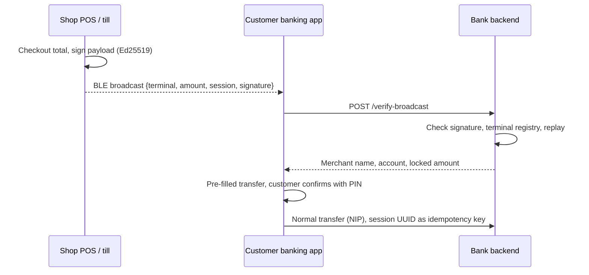

# Checkout Broadcast

Open-source SDK and protocol for **frictionless POS-to-banking-app payments** in Nigeria.

After checkout, a shop terminal broadcasts a **signed payment request** over Bluetooth LE. The customer's banking app picks it up, verifies it with the bank server, and **pre-fills the transfer screen** — no typing account numbers, no scanning, no wrong amounts.

[](https://github.com/amithyone/checkout_broadcast/actions/workflows/ci.yml)
[](https://github.com/amithyone/checkout_broadcast/releases)
[](LICENSE)
[](https://github.com/amithyone/checkout_broadcast/discussions)
[](https://amithyone.github.io/checkout_broadcast/)

**Website:** [amithyone.github.io/checkout_broadcast](https://amithyone.github.io/checkout_broadcast/). Anonymous checkout totals (no amounts) are on Vercel, counted only from enrolled verify servers: [spec/public-usage-count.md](spec/public-usage-count.md), [usage-site/](usage-site/README.md).

<!-- Demo: add a 30–60s screen recording as docs/assets/demo.gif (till broadcasts → phone pre-fills transfer) and embed it here. -->

## How it works



The money still moves over the rails banks already use. Checkout Broadcast only replaces the error-prone part: getting the right recipient and amount into the customer's app.

## Why Checkout Broadcast

| | Customer effort at the counter | Amount set by till | Tamper-proof request |
|--|-------------------------------|--------------------|----------------------|
| Manual bank transfer | Type 10-digit account, pick bank, type amount | No | No |
| Dynamic virtual account | Type a new account number every time | Partly | No |
| USSD | Dial code, step through menus | No | No |
| NQR / QR code | Open scanner, aim at code (static QR has no amount) | Only with dynamic QR on a screen | Depends on implementation |
| **Checkout Broadcast** | **Open app, tap the shop, confirm** | **Yes** | **Yes — signed by till, verified by bank** |

- **For banks and wallets:** fewer mistyped transfers and "I've sent it" disputes, a modern in-store experience, and no new settlement rail to certify. It complements NQR rather than replacing it.
- **For POS software and PTSPs:** a small add-on for Android or Windows/Linux POS apps. Most modern Android POS terminals already have Bluetooth.
- **For POS agents and merchants:** faster queues and payments that arrive with the right amount and a reference you can match.

## Who's using it

| Organisation | Role |
|--------------|------|
| CheckoutNow wallet app | Receives broadcasts ("Pay at shop") in production |
| Cheko / CheckoutPay | Merchant tills and Laravel `verify-broadcast` backend in production |

Using Checkout Broadcast in a bank, wallet, or POS product? Open a pull request to add yourself, or say hello in [Discussions](https://github.com/amithyone/checkout_broadcast/discussions).

## Platform status

| Component | Send (POS) | Receive (banking app) |
|-----------|-----------|------------------------|
| Python SDK (Windows / Linux POS) | Ready (BLE via `bleak`) | Ready |
| TypeScript SDK (web / Node) | Simulated only (browsers can't advertise BLE) | Ready (Web Bluetooth) |
| Android module (Kotlin) | In progress | Ready |
| iOS Swift Package | In progress | Ready |
| Reference bank API (Python / FastAPI) | — | Ready for testing |
| Laravel verify controller | — | Production (Cheko) |

**iOS note:** iOS limits Bluetooth scanning while an app is in the background, so for reliable pickup the customer should have the banking app open (for example on a "Pay at shop" screen). Android can scan from a foreground service.

## Features

- **Production wire** used by CheckoutNow / Cheko: compact BLE `{p,alg,sig}`, Ed25519, amounts in **kobo**, presence/idle tills
- Signed protocol (Ed25519 or HMAC-SHA256) with replay protection (timestamp + one-time session UUID)
- Drop-in SDK addon: `send` / `receive` / `both` roles
- **Reference bank API** for banks to test before production rollout
- Simulated transport for CI and local dev

The protocol is **HTTP JSON + BLE bytes**, not a Laravel protocol. Python, Kotlin, Swift, TypeScript, PHP, Go, or anything else works if it matches [spec/ble-transport.md](spec/ble-transport.md) and [spec/verify-api.md](spec/verify-api.md). `deploy/laravel/` and `bank_api/` are example servers.

**Implementers:** start with [spec/ble-transport.md](spec/ble-transport.md) and [docs/checkoutpay-integration.md](docs/checkoutpay-integration.md) — expand compact wire before `/verify-broadcast`.

## Quick start

```bash
git clone https://github.com/amithyone/checkout_broadcast.git
cd checkout_broadcast
python3 -m venv .venv && source .venv/bin/activate
pip install -r requirements.txt

cp .env.example .env
# Set CHECKOUT_BANK_ADMIN_KEY and CHECKOUT_SIGNING_KEY (min 16 chars)

# Terminal 1 — reference bank API
PYTHONPATH="sdk/python:." python -m checkout_broadcast.cli run-bank

# Terminal 2 — register terminal + send checkout
export CHECKOUT_SIGNING_KEY="your-secret-key-min-16-chars"
export CHECKOUT_BANK_ADMIN_KEY="change-me-before-production"
PYTHONPATH="sdk/python:." python -m checkout_broadcast.cli register-terminal
PYTHONPATH="sdk/python:." python -m checkout_broadcast.cli demo-send --amount 2500
```

## Integration guides

| Audience | Guide |
|----------|-------|
| **Decision makers (banks, PTSPs, regulators)** | [docs/one-pager.md](docs/one-pager.md) |
| **Production BLE wire (start here)** | [spec/ble-transport.md](spec/ble-transport.md) |
| **CheckoutPay / CheckoutNow path** | [docs/checkoutpay-integration.md](docs/checkoutpay-integration.md) |
| **Verify API contract** | [spec/verify-api.md](spec/verify-api.md) |
| **Banking / wallet apps** | [docs/banking-app-integration.md](docs/banking-app-integration.md) |
| **POS / shop terminal apps** | [docs/pos-app-integration.md](docs/pos-app-integration.md) |
| **Overview** | [docs/README.md](docs/README.md) |
| **vs CheckoutNow Nearby Pay** | [spec/coexistence-with-proprietary-nearby.md](spec/coexistence-with-proprietary-nearby.md) |

## CheckoutNow Nearby Pay vs Checkout Broadcast

| | Nearby Pay (CheckoutNow only) | Checkout Broadcast (open) |
|--|------------------------------|---------------------------|
| Purpose | Wallet P2P inside CheckoutNow | POS → any wallet app |
| BLE | Advert + pay code | GATT + signed JSON |
| UUID | `a7c5c816-…` | `cbbc0001-…` |
| Verify | CheckoutNow scan-resolve | Bank `verify-broadcast` |

Nearby Pay is **not** part of this repo's open protocol. See coexistence spec above.

## Project structure

```
checkout_broadcast/
├── sdk/python/          # POS SDK (sender) — primary implementation
├── sdk/typescript/      # Web banking SDK (receiver)
├── sdk/android/         # Android SDK
├── sdk/ios/             # iOS Swift Package
├── bank_api/            # Reference bank verification server
├── deploy/              # Production deploy notes, Laravel verify controller
├── spec/                # Protocol, signing, BLE specs
├── docs/                # Integration docs + GitHub Pages landing (`docs/index.html`)
├── usage-site/          # Vercel anonymous checkout counter
├── demos/               # Web receiver demo
└── tests/               # Conformance & bank API tests
```

## Bank testing (Docker)

```bash
docker compose up --build
# API: http://127.0.0.1:8090/health
```

## Install

> **Registry packages are coming soon.** `checkout-broadcast` (PyPI) and `@checkout-broadcast/web` (npm) are not published yet. Until then, install from GitHub:

```bash
# Python (POS SDK)
pip install "git+https://github.com/amithyone/checkout_broadcast.git@v1.5.0"
pip install "checkout-broadcast[ble] @ git+https://github.com/amithyone/checkout_broadcast.git@v1.5.0"   # BLE on Windows/Linux

# Web / Node (banking app SDK)
git clone https://github.com/amithyone/checkout_broadcast.git
cd checkout_broadcast/sdk/typescript && npm ci && npm run build && npm pack
npm install /path/to/checkout-broadcast-web-1.5.0.tgz   # in your app
```

Once published, these will become `pip install checkout-broadcast` and `npm install @checkout-broadcast/web`. See **[docs/publishing.md](docs/publishing.md)** for maintainer release steps (PyPI, npm, Maven).

## Security

See [SECURITY.md](SECURITY.md). Report vulnerabilities privately through [GitHub security advisories](https://github.com/amithyone/checkout_broadcast/security/advisories/new), not public issues.

**Production banks** must replace the reference SQLite server with HSM-backed keys, enterprise auth, and audited infrastructure.

## Contributing

See [CONTRIBUTING.md](CONTRIBUTING.md). Questions and integration help: [Discussions](https://github.com/amithyone/checkout_broadcast/discussions).

## License

MIT — see [LICENSE](LICENSE).
